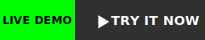
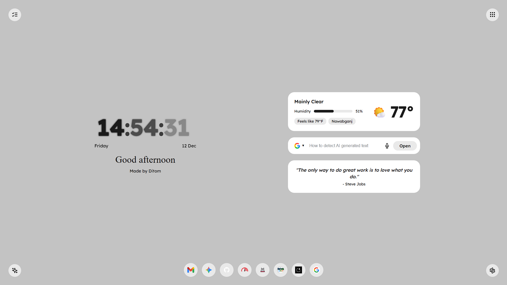
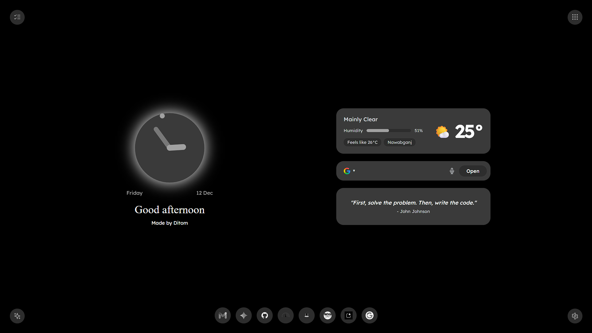
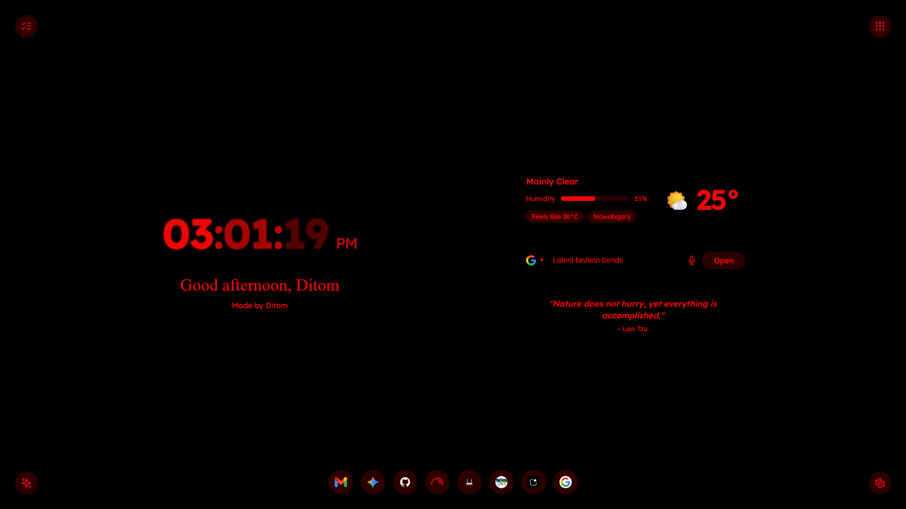
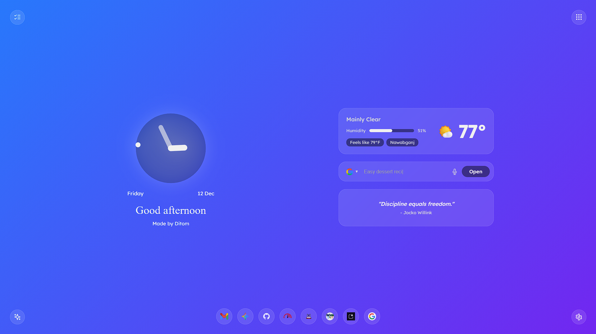
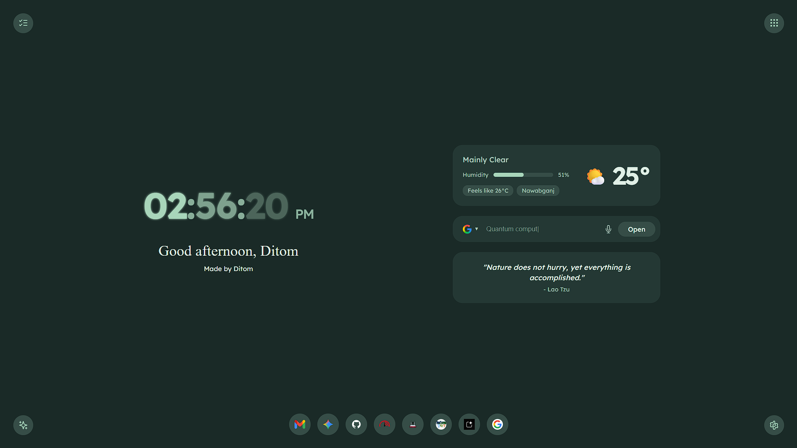
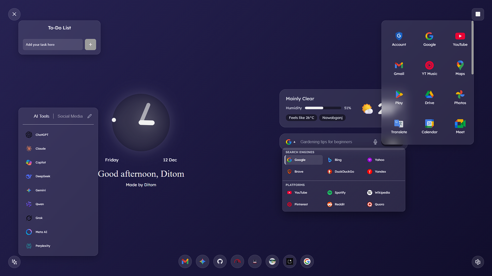
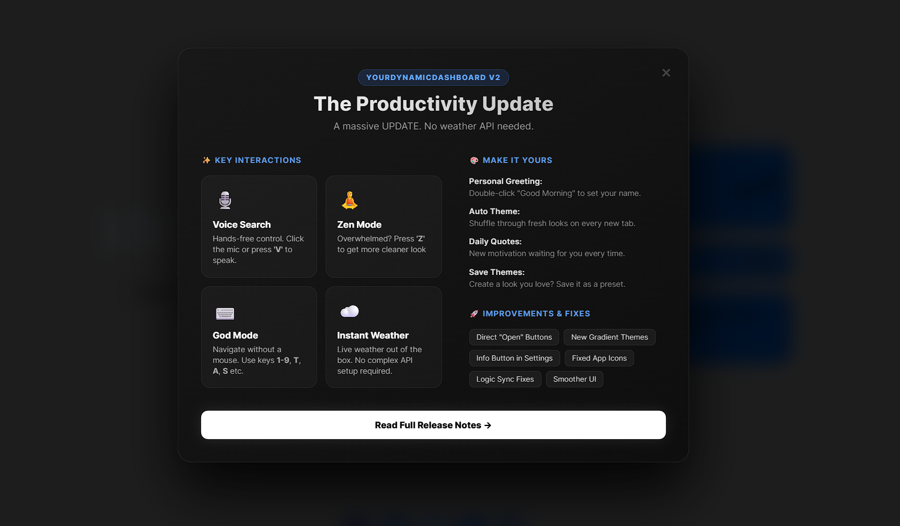

  <h1 align="center">🚀 YourDynamicDashboard (v2.1.0 Soon)</h1>
  

    <strong>The Productivity Update.</strong> 
    Transform your new tab into a powerful, privacy-first command center. 
    Featuring Voice Search, Zen Mode, and Instant Weather.
     
     
    <a href="#-features-v20"><strong>Features</strong></a> ·
    <a href="#%EF%B8%8F-installation-guide"><strong>Installation</strong></a> ·
    <a href="#%EF%B8%8F-keyboard-shortcuts"><strong>Keyboard Shortcuts</strong></a> ·
    <a href="#-mode--theme-overview"><strong>Extension Preview</strong></a>
  

  
  
  

<table>
  <tr>
    <td align="center" width="50%">
      
       <b>Focus Mode</b>
    </td>
    <td align="center" width="50%">
      
       <b>Productivity Hub</b>
    </td>
  </tr>
</table>

---

<h3>🔴 For a Live Test:</h3>

  

---

## ⚡ Why Choose YourDynamicDashboard?

Most New Tab Page/ Dashboards are either too simple (just a clock) or too cluttered (ads and news feeds). **YDD** strikes the perfect balance:

* **🔒 Privacy First:** No tracking. Your data (To-Do lists, links, settings) lives on your computer, not our servers.
* **🏎️ Speed:** Built with vanilla JavaScript. No heavy frameworks. Loads instantly.
* **🎨 Aesthetics:** Glassmorphism UI, animated gradients, and full color control.

---

## ✨ Features (v2.0)

YourDynamicDashboard has been completely re-engineered for productivity.

| Category | Premium Features |
| :--- | :--- |
| **🤖 Interaction** | <li>**Voice Search ("Jarvis Mode"):** Click the mic or press `V`. Speak your query, and it searches instantly.</li><li>**Zen Mode:** Press `Z` to banish all clutter. Only the clock and wallpaper remain.</li><li>**God Mode:** Full keyboard navigation (`1-9`, `T`, `A`, `S`) for power users.</li> |
| **🎨 Personalization** | <li>**Auto Theme Shuffle:** Get a fresh look every time you open a tab.</li><li>**Personal Greeting:** Double-click the text to set your nickname.</li><li>**Save Presets:** Crafted the perfect theme? Save it to a slot and switch back anytime.</li> |
| **☁️ Utilities** | <li>**Instant Weather:** No API keys required. We switched to Open-Meteo for privacy-friendly, zero-setup weather.</li><li>**Smart Search:** Switch engines (Google, Bing, DuckDuckGo) or platforms (YouTube, Reddit) instantly.</li><li>**Daily Quotes:** A rotating collection of wisdom to start your day.</li> |
| **⚡ Quick Access** | <li>**Draggable Shortcuts:** Reorder your favorite sites via drag-and-drop.</li><li>**AI Tools Menu:** Quick links to ChatGPT, Gemini, Claude, and more.</li><li>**Google Apps:** The classic 9-dot menu for Gmail, Drive, etc.</li> |

### 🎨 Mode & Theme Overview
<table>
  <tr>
    <td align="center">
      <b>Light Mode</b> 
      
    </td>
    <td align="center">
      <b>Dark Mode</b> 
      
    </td>
    <td align="center">
      <b>Crimson Red Mode</b> 
      
    </td>
  </tr>
  <tr>
    <td align="center">
      <b>Royalty Gradient Theme</b> 
      
    </td>
    <td align="center">
      <b>Forest Theme Mode</b> 
      
    </td>
    <td align="center">
      <b>PopUp Features</b> 
      
    </td>
  </tr>
</table>

---

## 🆕 New Feature Showcase

  
<b>Click to view New Feature Showcase</b>

   

  <table>
    <tr>
      <td align="center">
        <b>v.1.1.0 New Feature</b> 
        
      </td>
      <td align="center">
        <b>v.2.0 New Feature</b> 
        
      </td>
    </tr>
  </table>
  

---

## 🛠️ Installation Guide

### 🧩 Web Store (Stable)
*Stores may have older version if a new version has arrived recently.*

  
  
  

> [!NOTE]
> ‼️Follow these [steps](https://github.com/xtditom/YourDynamicDashboard?tab=readme-ov-file#-additional-steps-for-gecko-engine-based-browser-firefox-zen-etc) below to set it as the Homepage for Firefox, Zen, etc.
>
> ‼️Follow these [steps](https://github.com/xtditom/YourDynamicDashboard?tab=readme-ov-file#-additional-steps-for-opera--opera-gx) below to configure it for Opera/ Opera GX.

### 🦊 Additional steps for Gecko engine-based browser (Firefox, Zen, etc.)
*Firefox, Zen, Librewolf, etc. treat New Tabs and Homepages separately. To see your dashboard on startup:*

1.  **Install:** Get the extension from [Firefox Add-ons](https://addons.mozilla.org/en-US/firefox/addon/yourdynamicdashboard/).
2.  **Bookmark:** Open a **New Tab** (so the dashboard loads), then press `Ctrl+D` to bookmark it.
3.  **Configure:** Go to **Browser's Settings** > **Home**.
4.  **Select:** Under **"Homepage and new windows"**, choose **Custom URLs** → **Use Bookmark...** and pick the bookmark you just created.
5.  **Done:** Now your dashboard will load instantly when you start your browser.

<strong>⚠️ Important Step for Zen Browser Users</strong>

By default, Zen Browser does not open extensions on New Tabs. You must enable this:
1.  Open a new tab & Type `about:config` in your address bar and press Enter.
2.  Click **"Accept the Risk and Continue"**.
3.  Search for: `zen.urlbar.replace-newtab`
4.  Double-click it or manually set its value to **false**.
5.  Now open a new tab, and the dashboard will appear.

<strong>⚠️ Settings Not Saving? (LibreWolf / Zen)</strong>

If your Theme, Location, or To-Do list resets every time you close the browser:
* This happens because **"Delete cookies and site data when closed"** is enabled in your browser settings.
* **Fix:** Add an **Exception** for this extension in your Privacy & Security settings, or disable the auto-delete feature to allow `localStorage` to save your preferences.

### ⭕ Additional steps for Opera / Opera GX

<strong>➡️ Set as Startup Page AND New Tab Page</strong>

*Opera blocks extensions from changing the New Tab page by default. You need a simple "Helper" extension to fix this.*

1.  **Install:** Download the **[New Tab & Toolbox](https://chromewebstore.google.com/detail/new-tab-start-page/mjfahldkpjhcnfbbmdhpjolcjpcfhcpj)** extension from the Chrome Web Store.
2.  **Configure:** Open "New Tab & Toolbox" extension and select **Configuration**.
3.  **Set URL:** In the "Custom URL" box, paste this exact ID:
    `chrome-extension://fckmlnagohleefboaleepppikpdkckjn/index.html`
4.  **Activate:** Change **"Override default Start Page when browser launches"** to **YES**.
5.  **Save:** Click the **Save** button at the bottom.
    * *Result:* You will now see your dashboard when opening a New Tab AND when starting Opera.

<strong>➡️ Set as Startup Page only</strong>

*If you only want the dashboard to appear when you first launch Opera (but keep the default Speed Dial for new tabs):*

1.  **Settings:** Go to **Browser Settings** (`Alt+P`) > **On Startup**.
2.  **Select:** Choose **"Open a specific page or set of pages"** → **Add a new page**.
3.  **Paste:** Enter this URL and click **Add**:
    `chrome-extension://fckmlnagohleefboaleepppikpdkckjn/index.html`
4.  **Done:** The dashboard will now load automatically whenever you launch Opera.

---

### ⚡ Manual Installation

#### 🟢 Chromium Browsers (Chrome, Edge, Brave, etc.)

**1. Download & Prepare**
1.  Click the button above to download the latest `.zip` release. Or, direct download 
2.  **Unzip** the folder to a **permanent location** (e.g., `Downloads/YDD`).
    > ⚠️ **Important:** Do not delete or move this folder after installing, or the extension will stop working.

**2. Load into Browser**
1.  Open your browser's extension manager by typing `chrome://extensions` in the URL bar. (*Doesn't matter if you are using Edge, Brave, etc.*)
2.  Toggle **Developer Mode** on (usually a switch in the top-right corner 🛠️).
3.  Click the **Load Unpacked** button.
4.  Select the folder you extracted in Step 1.
5.  **Done!** Open a new tab to see your new dashboard.

#### 🦊 Gecko Browsers (Firefox, Zen, Waterfox, etc.)

**1. Download & Prepare**
1.  Download the latest `.xpi` release from above. Or, Direct download: 
2.  Keep the `.xpi` file in a **safe location** (e.g., `Downloads/YDD`).
    > ⚠️ **Important:** Do not delete or move this file after installing, or the extension will stop working.

**2. Load into Browser**
1.  Open your browser's extension manager by typing `about:addons` in the URL bar.
2.  Click the ⚙️ **(Settings Icon)** next to "Manage Your Extensions".
3.  Select **Install Add-on From File...**
4.  Browse and select the `.xpi` file you downloaded.
5.  **Done!** Open a new tab to see your new dashboard.

---

## ⚙️ Configuration

**Good news!** As of v2.0, **configuration is essentially zero.**

* **Weather:** Auto-detects your approximate location securely.
    * *Prefer manual?* Go to **Settings > Functions > Custom Location** and type your city.
* **Search:** Click the icon in the search bar to switch between Google, Bing, YouTube, etc.
* **Shortcuts:** Use the Settings panel to add/edit/delete shortcuts.

---

## ⌨️ Keyboard Shortcuts

Navigate like a pro without touching your mouse.

| Key | Action |
| :--- | :--- |
| **`V`** | **Voice Search:** Activate microphone instantly. |
| **`Z`** | **Zen Mode:** Toggle distractions On/Off. |
| **`/`** | **Focus Search:** Jump to the search bar. |
| **`T`** | Toggle **To-Do List**. |
| **`A`** | Toggle **AI / Social Tools**. |
| **`G`** | Toggle **Google Apps Grid**. |
| **`S`** | Open **Settings**. |
| **`1-9`** | Launch **Shortcut Link** (1 through 9). |

*You can also re-bind the keys in Settings.*

---

## 📄 License

This project is licensed under the **Creative Commons BY-NC-SA 4.0 License**. See the [LICENSE](LICENSE) file for more details.

---

## 🛡 Privacy Policy

With **YourDynamicDashboard**, you are the product owner, not the product.

* **No Analytics:** We do not track you.
* **Local Storage:** Your todos, shortcuts, and themes stay on your PC.
* **Icons:** Icons sourced from various open-source libraries.
* **Voice Search:** Processed locally by your browser's Web Speech API; audio is never sent to us.
* **Weather Data:** We use [Open-Meteo](https://open-meteo.com/), a privacy-focused open-source weather provider.

Read the full [Privacy Policy](https://xtditom.github.io/YourDynamicDashboard/privacy-policy.html).

---

## 🔜 Future Plans

Features that may come in the **future** we planned!

1. Add **Unsplash API** for random wallpapers.
2. Enhance the **To-Do** List & **Smart Search**.
3. Fix UI & Visual bugs.
4. Enhance **Clock** & **AI Tools**.
5. Make widgets **draggable** for hyper customization.

---

## 🤝 Contributing

Contributions, issues, and feature requests are welcome!
Feel free to check the [issues page](https://github.com/xtditom/YourDynamicDashboard/issues).

1.  Fork the Project
2.  Create your Feature Branch (`git checkout -b feature/AmazingFeature`)
3.  Commit your Changes (`git commit -m 'Add some AmazingFeature'`)
4.  Push to the Branch (`git push origin feature/AmazingFeature`)
5.  Open a Pull Request

---

## ❤️ Acknowledgments

* **Inspiration:** A huge thanks to **XengShi** for their project, **[MaterialYouNewTab](https://github.com/prem-k-r/MaterialYouNewTab)**, which served as a major inspiration. (Currently maintained by _Prem Kumar_ & _Itz-RJ_)
* **AI Assistance:** Developed with help from **Google's Gemini Pro**.

---

  <h3>Created with ❤️ by <a href="https://github.com/xtditom">Ditom Baroi Antu</a></h3>
  
© 2025-2026 All Rights Reserved.

