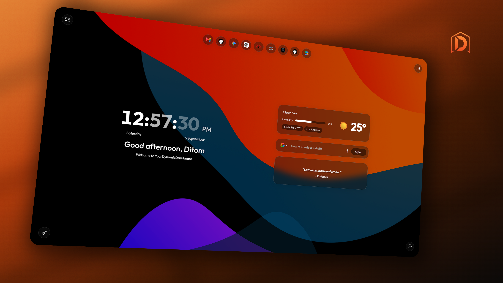
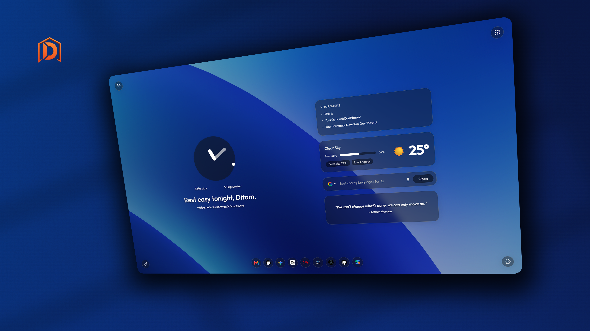
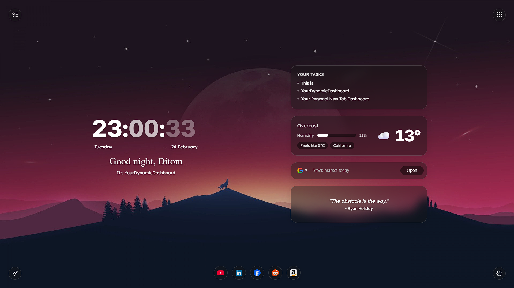
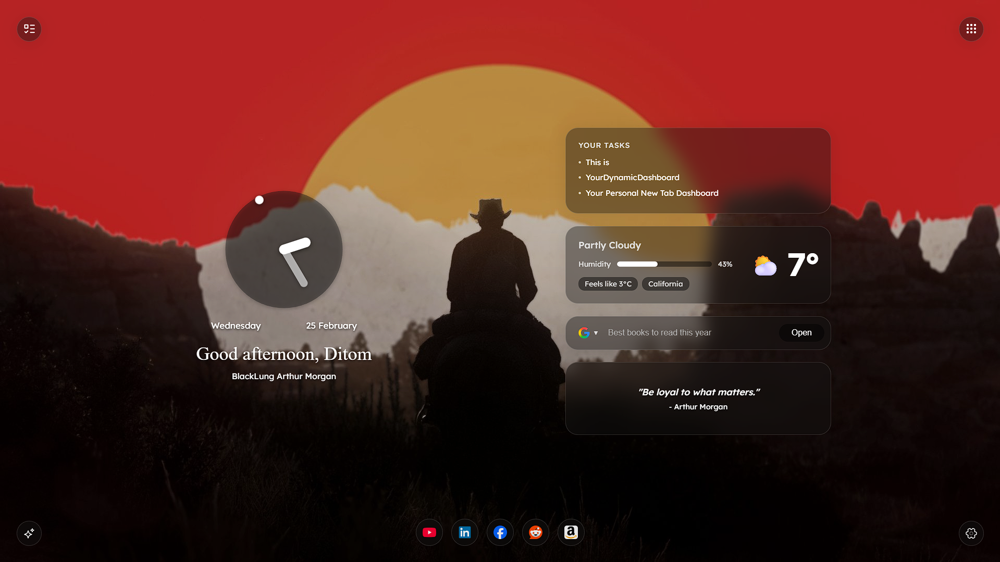
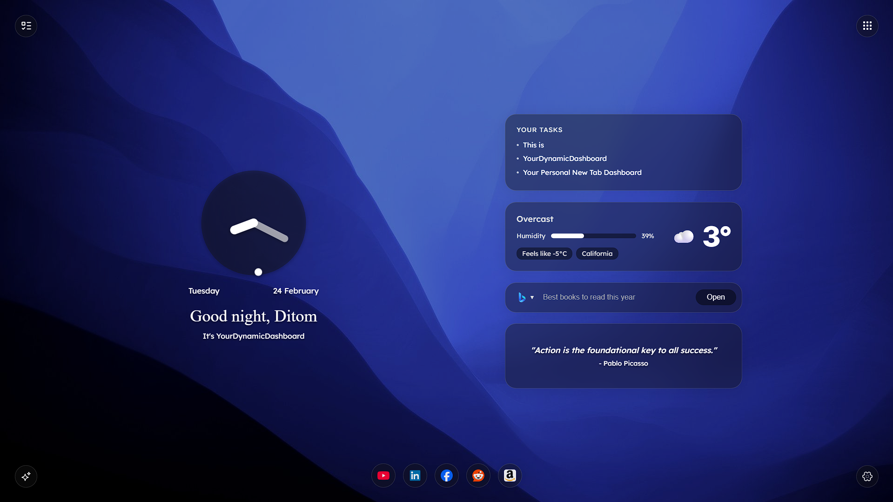
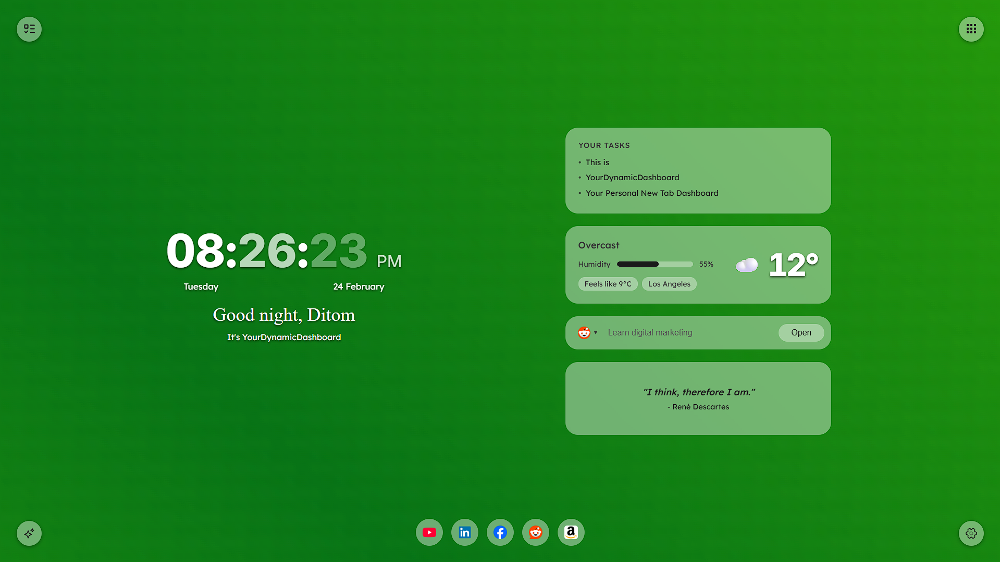
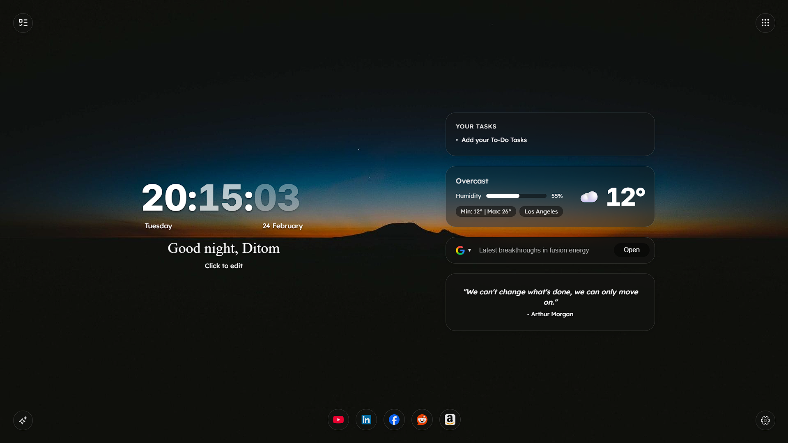
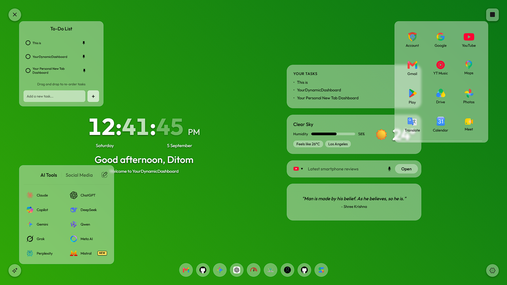

  <h1 align="center">🚀 YourDynamicDashboard (v3.0.0)</h1>
  

    <strong>The Biggest Update Ever.</strong> 
    Transform your new tab into a powerful, customizable,  minimalist & privacy-first command center. 
     
    <a href="#-features-of-v3"><strong>Features</strong></a> ·
    <a href="#-the-showcase"><strong>Extension Preview</strong></a> .
    <a href="https://ditom.me/ydd"><strong>YDD Landing Page</strong></a> .
        <a href="#%EF%B8%8F-installation-guide"><strong>Installation</strong></a>
  

  
  
  
  

  
  
  
  

<table>
  <tr>
    <td align="center" width="50%">
      
       <b>Transform Your</b>
    </td>
    <td align="center" width="50%">
      
       <b>New Tab Page</b>
    </td>
  </tr>
</table>

---

 

  <h3>🔴 For a Live Test:</h3>
  

 

---

## ⚡ Why Choose YourDynamicDashboard?

Most new-tab dashboards are either too simple or overloaded with distractions. **YDD** gives you a focused, flexible command center that adapts to the way you work:

* **🔒 Privacy First:** No account, analytics, or behavioral profiles. Your history, tasks, links, settings, and news cache stay in your browser.
* **🏎️ Fast & Lightweight:** Built with vanilla JavaScript and no heavy framework, keeping the dashboard responsive and quick to load.
* **⌨️ Command-Driven:** Use the Command Palette, customizable shortcuts, and search bang commands to reach actions, tools, and services quickly.
* **🎨 Personal by Design:** Shape the experience with custom themes, backgrounds, icons, widget visibility, and separate Mini and Full Settings.
* **🌐 Optional Live Features:** Enable weather, News Feeds, or online suggestions only when you want them, with clear control over their data flow.

---

## ✨ Features of V3

YourDynamicDashboard has been heavily upgraded with the "Performance & Scaling" patch.

| Category | Premium Features |
| :--- | :--- |
| **🤖 Interaction** | <li>**Local Search History:** Native-feeling, privacy-first search history with real-time filtering and auto-delete.</li><li>**Command Palette:** Press `Ctrl+K` or `Cmd+K` to access dashboard actions, settings, tools, and search from one keyboard-driven panel.</li><li>**Drag & Drop Engine:** Reorder To-Do tasks, AI Tools, and Google Apps seamlessly.</li><li>**Voice Search:** Hands-free control with privacy-browser fallback support.</li><li>**Zen Mode:** Press `Z` to banish all clutter. Only the clock and wallpaper remain.</li> |
| **🎨 Personalization** | <li>**Custom Icons:** Upload and set your own image icons for individual web shortcuts.</li><li>**Theme Generator:** Create custom themes with advanced color and gradient support.</li><li>**BG Blur Control:** Adjust the blur intensity of custom backgrounds for perfect UI readability.</li><li>**Random Backgrounds:** Fetch fresh wallpapers automatically, and **Freeze** the ones you love.</li> |
| **☁️ Utilities** | <li>**Advanced Weather:** Live local weather including daily Min/Max temperatures. No API keys required.</li><li>**Expanded Search:** Switch engines or platforms with commands such as `!g`, `!yt`, `!sp`, and `!w`, with Perplexity, Google AI Search, and optional online suggestions available.</li><li>**RSS News Feeds:** Follow selected publishers through an optional, customizable news feed.</li><li>**Widget Expansion:** More granular visibility combinations (e.g., Search & Quote, Weather & Quote).</li> |
| **⚡ Quick Access** | <li>**Separated Settings:** Use Mini Settings for everyday controls and Full Settings for advanced configuration.</li><li>**Custom Integrations:** Add your own AI tools, social links, search engines, and apps.</li><li>**Backup & Restore:** Export and import your settings, including background data.</li><li>**UI Toggles:** Hide greetings and editable text instantly via settings or custom shortcut keys.</li><li>**Link Direction:** Control exactly how and where your shortcut links open.</li><li>**Layout Flexibility:** Dock your Shortcuts bar to either the Top or Bottom of the screen.</li> |

### 🎨 The Showcase
<table>
  <tr>
    <td align="center" width="33%">
      <b>Glassmorphism</b> 
      
    </td>
    <td align="center" width="33%">
      <b>Wild West</b> 
      
    </td>
    <td align="center" width="33%">
      <b>Blue Abstract</b> 
      
    </td>
  </tr>
  <tr>
    <td align="center" width="33%">
      <b>Bio Lime</b> 
      
    </td>
    <td align="center" width="33%">
      <b>The Dawn</b> 
      
    </td>
    <td align="center" width="33%">
      <b>PopUp Features</b> 
      
    </td>
  </tr>
</table>

---

## 🛠️ Installation Guide

### 🧩 Web Store (Stable)
*Stores may have older versions if a new update has arrived recently.*

  
  
  

> [!NOTE]
> ‼️Follow these [steps](https://github.com/xtditom/YourDynamicDashboard?tab=readme-ov-file#-additional-steps-for-gecko-engine-based-browser-firefox-zen-etc) below to set it as the Homepage for Firefox, Zen, etc.
>
> ‼️Follow these [steps](https://github.com/xtditom/YourDynamicDashboard?tab=readme-ov-file#-additional-steps-for-opera--opera-gx) below to configure it for Opera/ Opera GX.

### 🦊 Additional steps for Gecko engine-based browser (Firefox, Zen, etc.)
*Firefox, Zen, Librewolf, etc. treat New Tabs and Homepages separately. To see your dashboard on startup:*

1.  **Install:** Get the extension from [Firefox Add-ons](https://addons.mozilla.org/en-US/firefox/addon/yourdynamicdashboard/).
2.  **Bookmark:** Open a **New Tab** (so the dashboard loads), then press `Ctrl+D` to bookmark it.
3.  **Configure:** Go to **Browser's Settings** > **Home**.
4.  **Select:** Under **"Homepage and new windows"**, choose **Custom URLs** → **Use Bookmark...** and pick the bookmark you just created.
5.  **Done:** Now your dashboard will load instantly when you start your browser.

<strong>⚠️ Important Step for Zen Browser Users</strong>

By default, Zen Browser does not open extensions on New Tabs. You must enable this:
1.  Open a new tab & Type `about:config` in your address bar and press Enter.
2.  Click **"Accept the Risk and Continue"**.
3.  Search for: `zen.urlbar.replace-newtab`
4.  Double-click it or manually set its value to **false**.
5.  Now open a new tab, and the dashboard will appear.

<strong>⚠️ Settings Not Saving? (LibreWolf / Zen)</strong>

If your Theme, Location, or To-Do list resets every time you close the browser:
* This happens because **"Delete cookies and site data when closed"** is enabled in your browser settings.
* **Fix:** Add an **Exception** for this extension in your Privacy & Security settings, or disable the auto-delete feature to allow `localStorage` to save your preferences.

### ⭕ Additional steps for Opera / Opera GX

<strong>➡️ Set as Startup Page AND New Tab Page</strong>

*Opera blocks extensions from changing the New Tab page by default. You need a simple "Helper" extension to fix this.*

1.  **Install:** Download the **[New Tab & Toolbox](https://chromewebstore.google.com/detail/new-tab-start-page/mjfahldkpjhcnfbbmdhpjolcjpcfhcpj)** extension from the Chrome Web Store.
2.  **Configure:** Open "New Tab & Toolbox" extension and select **Configuration**.
3.  **Set URL:** In the "Custom URL" box, paste this exact ID:
    `chrome-extension://fckmlnagohleefboaleepppikpdkckjn/index.html`
4.  **Activate:** Change **"Override default Start Page when browser launches"** to **YES**.
5.  **Save:** Click the **Save** button at the bottom.
    * *Result:* You will now see your dashboard when opening a New Tab AND when starting Opera.

<strong>➡️ Set as Startup Page only</strong>

*If you only want the dashboard to appear when you first launch Opera (but keep the default Speed Dial for new tabs):*

1.  **Settings:** Go to **Browser Settings** (`Alt+P`) > **On Startup**.
2.  **Select:** Choose **"Open a specific page or set of pages"** → **Add a new page**.
3.  **Paste:** Enter this URL and click **Add**:
    `chrome-extension://fckmlnagohleefboaleepppikpdkckjn/index.html`
4.  **Done:** The dashboard will now load automatically whenever you launch Opera.

---

### ⚡ Manual Installation

#### 🟢 Chromium Browsers (Chrome, Edge, Brave, etc.)

**1. Download & Prepare**
1.  Click the button above to download the latest `.zip` release. Or, direct download 
2.  **Unzip** the folder to a **permanent location** (e.g., `Downloads/YDD`).
    > ⚠️ **Important:** Do not delete or move this folder after installing, or the extension will stop working.

**2. Load into Browser**
1.  Open your browser's extension manager by typing `chrome://extensions` in the URL bar. (*Doesn't matter if you are using Edge, Brave, etc.*)
2.  Toggle **Developer Mode** on (usually a switch in the top-right corner 🛠️).
3.  Click the **Load Unpacked** button.
4.  Select the folder you extracted in Step 1.
5.  **Done!** Open a new tab to see your new dashboard.

#### 🦊 Gecko Browsers (Firefox, Zen, Waterfox, etc.)

**1. Download & Prepare**
1.  Download the latest `.xpi` release from above. Or, Direct download: 
2.  Keep the `.xpi` file in a **safe location** (e.g., `Downloads/YDD`).
    > ⚠️ **Important:** Do not delete or move this file after installing, or the extension will stop working.

**2. Load into Browser**
1.  Open your browser's extension manager by typing `about:addons` in the URL bar.
2.  Click the ⚙️ **(Settings Icon)** next to "Manage Your Extensions".
3.  Select **Install Add-on From File...**
4.  Browse and select the `.xpi` file you downloaded.
5.  **Done!** Open a new tab to see your new dashboard.

---

## 📄 License

This project is legally protected and licensed under the **GNU General Public License v3.0**. 

**What this means:**
* **✅ Permissions:** You are completely free to use, modify, and distribute this software for private or commercial purposes.
* **🛑 Conditions (Copyleft):** If you modify and distribute this codebase, **you must** make your entire modified project open-source and free under the exact same GPLv3 license. You cannot take this code, modify it, and hide it in a closed-source project.
* **⚠️ No Warranty:** This software is provided "as is", without warranty of any kind.

See the [LICENSE](LICENSE) file for the full legal text and details.

---

## 🛡 Privacy Policy

With **YourDynamicDashboard**, you are the product owner, not the product.

* **Local-first:** Your customizations, search history, preferences, and News Feed cache stay in your browser. YDD has no account system and does not automatically upload this data.
* **Search Suggestions:** History Only is the default and sends nothing typed online. Optional online modes send only the current prefix to the selected relay/provider after consent; results are cached locally for a limited time.
* **News Feeds:** Optional and disabled by default. YDD connects directly to selected publishers through their RSS/RDF feeds or publisher-operated API, stores story metadata locally, and does not send browsing history or use a YDD news relay.
* **Voice & Location:** Voice Search uses your browser's Web Speech API and YDD does not record or store your voice. Location is requested only after you click and confirm, then sent to weather providers and saved locally.
* **Third-Party Services:** Weather, autocomplete, fonts, favicons, backgrounds, and other online features use the providers described in the full policy. Those providers may process ordinary network metadata under their own policies.

Read the full [Privacy Policy](https://xtditom.github.io/YourDynamicDashboard/privacy-policy.html).

---

## 🤝 Contributing

Contributions, issues, and feature requests are welcome!
Feel free to check the [issues page](https://github.com/xtditom/YourDynamicDashboard/issues).

1.  Fork the Project
2.  Create your Feature Branch (`git checkout -b feature/AmazingFeature`)
3.  Commit your Changes (`git commit -m 'Add some AmazingFeature'`)
4.  Push to the Branch (`git push origin feature/AmazingFeature`)
5.  Open a Pull Request

---

## ❤️ Acknowledgments

* **Inspiration:** A huge thanks to **XengShi** for their project, **[MaterialYouNewTab](https://github.com/prem-k-r/MaterialYouNewTab)**, which served as a major inspiration. (Currently maintained by _Prem Kumar_ & _Itz-RJ_)
* **AI Assistance:** Developed with help from **Google's Gemini & OpenAI's ChatGPT**.

---

  <h3>Created with ❤️ by <a href="https://github.com/xtditom">Ditom Baroi Antu</a></h3>
  
© 2025-2026 All Rights Reserved.

